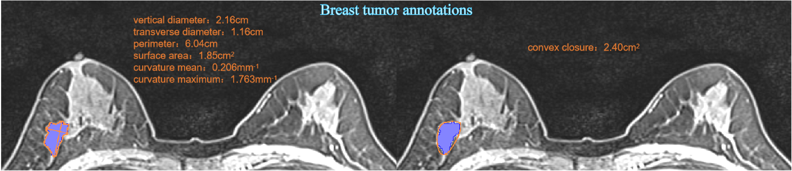
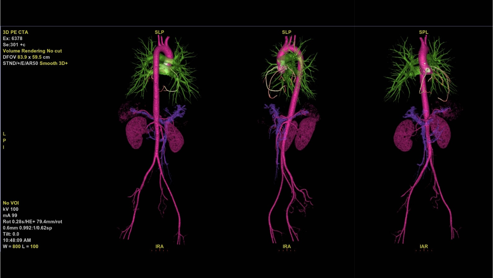

- Our doctor team was established in 2017, comprising of outstanding doctors in the field of medical imaging from all over the country, with 12 senior titles, 28 intermediate titles, and 30 junior titles. The team is competent enough to handle various work requirements in different scenarios. Starting from early 2017, the team began participating in remote medical diagnosis on the Internet. Subsequently, the team gradually participated in tasks related to artificial intelligence imaging annotation and pathology annotation.
- Our team is capable of carrying out multiple task labeling simultaneously, including previous labeling tasks such as lung nodules, rib fractures, vertebral bodies and appendages, lung segmentation, coronary artery segmentation, coronary stenosis labeling, and MRI labeling for brain tumors. 

  
  
      
brain tumor annotations

- Currently, our labeling partners mainly include Xingmai under Shanghai Fosun, Beijing Yizhun, Lunqin Medical, medical examination institutions, and some tertiary hospitals' doctors and research institutions. Leveraging our expertise in medical imaging, we aim to build a solid foundation to support the integration of medicine and technology.

Business Scope
======
- Remote Diagnosis with Imaging: Detect Lesions, Identify Abnormalities, and Provide Clear Recommendations. Specifically, this service screens for abnormal images, analyzes lesions, and provides expert recommendations based on experience. Suggestions may include further hospital examination, regular follow-up, and analysis based on clinical history. Different imaging features are evaluated and appropriate recommendations are given to avoid standardization and reflect personalized examination.
- Image AI Annotation for Imaging: Mainly according to the purchaser's requirements, the interested ROI in X-ray, CT, and MR images are outlined, requiring edge-to-edge placement, smooth edges, and classification of the outlined content to fulfill the purchasing purpose.
- Artificial intelligence pathology image annotation: similar to image annotation, conducting pathology-related tasks.

  
  
      
Illustration of PE-CTA

News 
======
- 

For more info
------
Last updated in Feb. 2023 by L.
